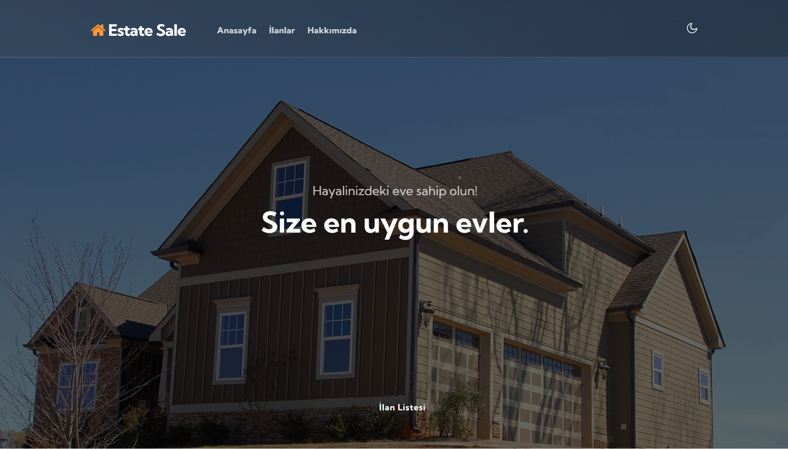
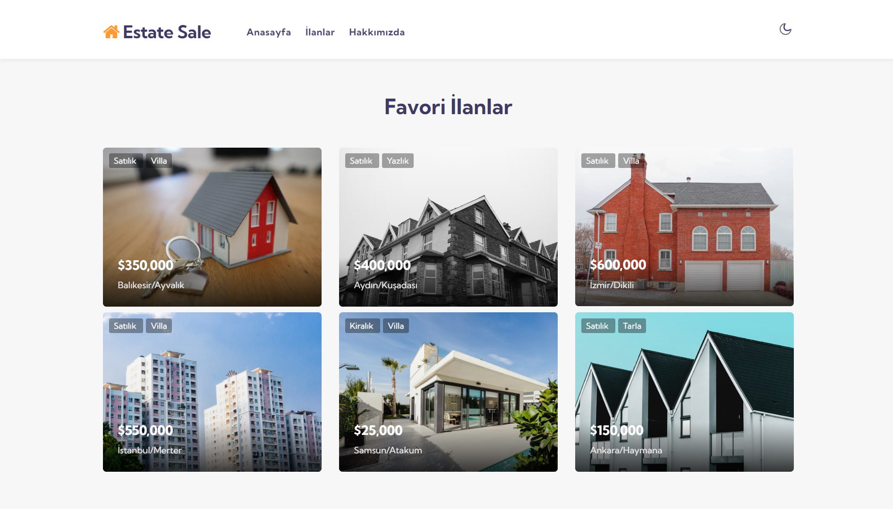
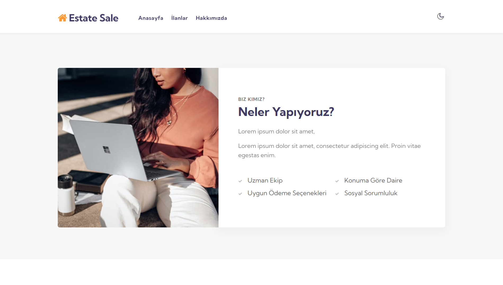
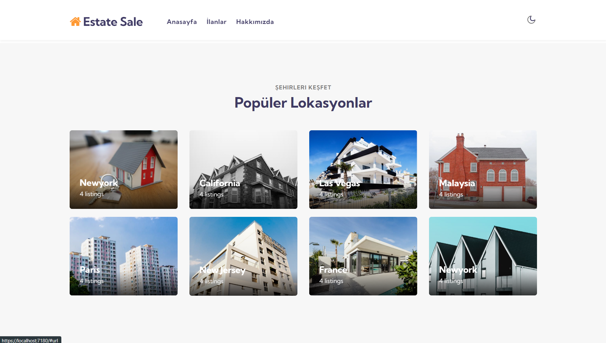
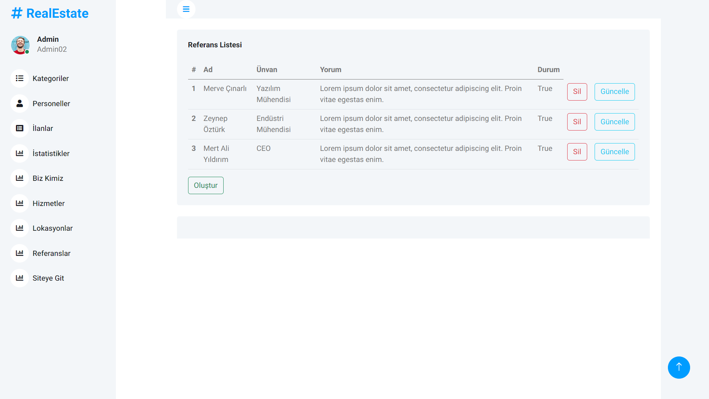
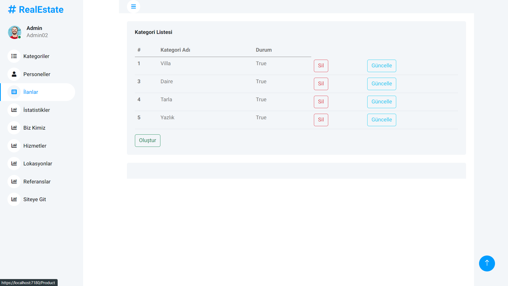

# Proje Detayı
Bu proje Dapper ve Asp.Net kullanılarak geliştirilmiş bir Emlak İlanı yayınlama sitesidir. Sayfadaki her öğe dinamik haldedir ve ilan yönetimi yapılabilir.

## Kullanılan Teknolojiler
- ASP.NET
- Sql
- Dapper
- MVC
- Non-Generic Repository Pattern
- View Component

## Ekran Görüntüleri

